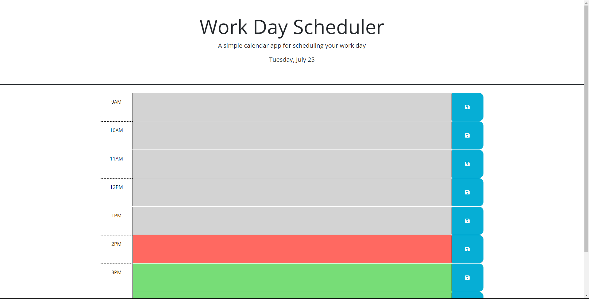

# Block-Scheduler

## Description

As a developer,

I wanted to create a block-style scheduler that is saved to your local device and displays the current day,

So that users can use this application to schedule their time effectively and reference back to the scheduler if they close the web application out.

## Installation

Proceed to this link: [Block Scheduler](https://lorenzo-olivar.github.io/Block-Scheduler/)

## Usage

The time blocks automatically change colors (GRAY = Past / RED = Present / GREEN = Future) based on the current time

AND

all you have to do is type in the time block boxes and save your events by clicking on the button to the right of the time block 

## License

MIT Lisense
